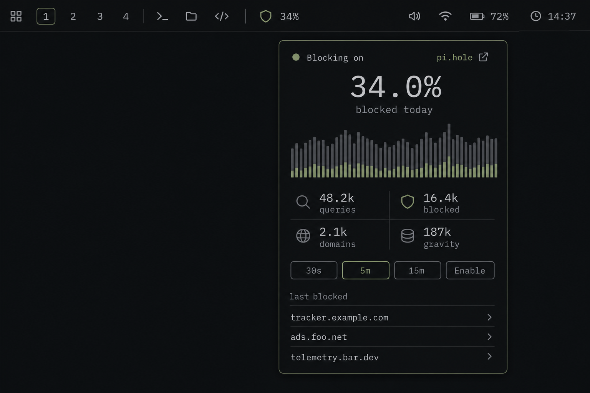

<p align="center">
  
</p>

# OmaPihole

<p align="center">
  
</p>

Pi-hole presence in the Omarchy bar: **state, pause, glance.**

Not a dashboard. A shield in the bar, a pause in the panel.

- See that blocking is on — or that you paused it for a broken site and forgot.
- Pause for 30 seconds, 5 minutes, or 15 minutes without leaving the current window.
- Glance at today’s block rate and the last three blocked domains.

Pi-hole v6 only. One instance. App password in a mode-600 file, never in `shell.json`.

## Install

OmaPihole is a third-party plugin and runs **unsandboxed** inside `omarchy-shell`, with your user permissions. Review the repository before enabling it.

```sh
omarchy plugin add https://github.com/BVisagie/omarchy-omapihole.git --enable
```

Without `--enable`, Omarchy clones the repo, validates the manifest, and leaves the widget off so you can read the checkout at `~/.config/omarchy/plugins/bvisagie.omapihole/` first. Enable later with `omarchy plugin enable bvisagie.omapihole`.

The widget lands in the right bar section. Requires `python3` and `curl`.

## Setup

1. On the Pi-hole: **Settings → Web interface / API → app password**.
2. Pi-hole supports one application password. If another integration already uses it, reuse that password where appropriate instead of needlessly rotating it.
3. Write the password to `~/.config/omapihole/password` (outside `~/.config/omarchy/`, which is what people commit to dotfiles repos) and `chmod 600` that file. OmaPihole does not support an interactive TOTP prompt; use the Pi-hole application password when 2FA is enabled.
4. Left-click the muted shield, fill in the API origin (prefer `https://pi.hole` or another HTTPS origin with a trusted certificate), and **Test connection**. Save on success, or Save explicitly. Use `http://` only on a trusted LAN: it sends the password and session ID without transport encryption.

Passwordless / local-trust Pi-holes work with an empty or missing password file.

## Using it

| | |
|---|---|
| Left click | Open / close the panel |
| Middle click | Refresh now |
| Right click | Open the dashboard (`dashboardUrl`, or `url` + `/admin/`) |
| `1` `2` `3` | Pause 30s / 5m / 15m |
| `e` | Resume / enable |
| `r` | Refresh |
| `o` | Open dashboard |
| Esc | Close |

While blocking is off, the bar shows a live countdown instead of the metric. At 0 it returns to `%` without sitting on `0:00`.

## Settings

Stored on the widget’s `shell.json` layout entry. Booleans and integers need `--json` or they land as strings (the plugin still coerces hand-edited strings):

```sh
omarchy bar set bvisagie.omapihole url 'http://pi.hole'
omarchy bar set bvisagie.omapihole allowInsecure true --json
omarchy bar set bvisagie.omapihole refreshSeconds 20 --json
```

| Key | Default | Meaning |
|---|---|---|
| `url` | `""` | API origin, no trailing path. Empty → unconfigured. |
| `dashboardUrl` | `""` | Optional right-click / ↗ target when the UI is not on the API host. |
| `passwordFile` | `~/.config/omapihole/password` | App password file. Mode 600 required if the file exists. |
| `allowInsecure` | `false` | Skip TLS verification for self-signed LAN HTTPS. Prefer installing the Pi-hole CA instead. |
| `refreshSeconds` | `20` | Bar poll interval, 10–120. |
| `barMetric` | `percent` | Bar label while blocking is on: `percent`, `rate` (q/min), or `queries`. Overridden by pause/off. |

## Update

```sh
omarchy plugin update bvisagie.omapihole
omarchy restart shell
```

`plugin update` hot-reloads the widget in place, which can leave it showing "Not configured" even though `shell.json` still has your settings. Follow it with `omarchy restart shell` to be sure the widget picks its saved settings back up.

## Uninstall

```sh
omarchy plugin remove bvisagie.omapihole
```

That removes the plugin checkout. It does not delete `~/.config/omapihole/password`.

## Tests

```sh
python3 -m unittest discover -s tests -v
node --test tests/test_model.js
omarchy plugin validate .
```
